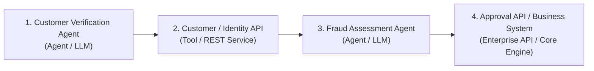
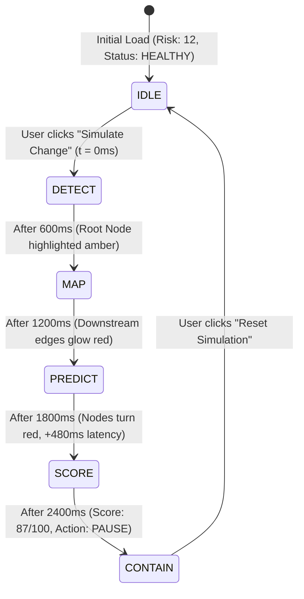

# FLOWTRACE — Master Implementation Plan
**Predictive AI Workflow Reliability & Impact Engine (Hackathon Prototype)**

---

## 1. Executive Summary & Core Value Proposition

**FLOWTRACE** is an enterprise-grade observability and predictive blast-radius containment engine for enterprise AI workflows. In modern enterprise agentic architectures, multi-step LLM workflows depend on external tools, microservices, and databases. When an upstream API changes or degrades, failures propagate silently across downstream agents and automated business systems.

FLOWTRACE solves this by modeling AI workflows as connected, observable dependency graphs that automatically **predict and contain failure cascades before they execute**.

```
   ┌──────────────┐     ┌──────────────┐     ┌────────────────┐     ┌───────────────┐     ┌──────────────────────┐     ┌──────────────────────┐
   │   Workflow   │ ──> │   Observer   │ ──> │ Dependency     │ ──> │ Impact Engine │ ──> │ Risk / Policy Engine │ ──> │ ALLOW / WARN / PAUSE │
   │  Execution   │     │  Telemetry   │     │ Graph (DAG)    │     │ (Predictive)  │     │  (Score: 0 - 100)    │     │  (Containment Action)│
   └──────────────┘     └──────────────┘     └────────────────┘     └───────────────┘     └──────────────────────┘     └──────────────────────┘
```

### The 10-Second Judge Takeaway
- **WHAT**: FLOWTRACE predicts cascading failures in enterprise AI workflows before they execute.
- **HOW**: It models agent-tool-API dependencies as a graph and simulates the blast radius of changes.
- **WHY**: Upstream API/schema changes silently break downstream AI agents and transactional systems.

### Core Product Principle
$$\text{\textbf{DETECT}} \;\longrightarrow\; \text{\textbf{PREDICT}} \;\longrightarrow\; \text{\textbf{CONTAIN}}$$

---

## 2. Canonical Demo Story & Workflow

The hackathon prototype is strictly built around **one canonical, highly realistic enterprise AI workflow**:



### The Breaking Change Scenario:
1. **Initial Baseline State**:
   - Workflow Status: **`HEALTHY`**
   - Baseline Risk Score: **`12 / 100`**
   - Latency: **`110 ms`** (All nodes green, active telemetry normal)
2. **Event Trigger**:
   - User selects simulation: *"Customer Identity API v2.4 Schema Deprecation (`ssn_hash` field altered to `national_id_token`)"*.
   - User clicks **"Simulate Change"**.
3. **Stage-by-Stage Progression**:
   - **`STAGE 1: DETECT`** — Root anomaly flagged at `Customer / Identity API`. Node pulses amber with *Schema Mismatch Detected*.
   - **`STAGE 2: MAP`** — Downstream dependency path highlighted with animated glowing edges: `Customer / Identity API` $\rightarrow$ `Fraud Assessment Agent` $\rightarrow$ `Approval API / Business System`.
   - **`STAGE 3: PREDICT`** — Predictive engine projects impact metrics:
     - **Affected Components**: `3 Downstream Systems`
     - **Projected Latency Surge**: `+480 ms`
     - **Predicted Validation Failure Probability**: `94.2%`
   - **`STAGE 4: SCORE`** — Risk engine computes composite risk:
     - **Risk Score**: `87 / 100`
     - **Severity Level**: **`CRITICAL`**
   - **`STAGE 5: CONTAIN`** — Automated circuit breaker trigger:
     - **Recommendation**: **`PAUSE WORKFLOW`**
     - Clear plain-English explanation displayed with one-click containment execution.
4. **Reset**:
   - User clicks **"Reset Simulation"** to instantly restore the workflow to **`HEALTHY (12/100)`**.

---

## 3. Technology Stack & Architectural Boundaries

### Hackathon Prototype (In-Scope)
- **Frontend Framework**: React 19 + TypeScript + Vite
- **Styling & Theme**: Tailwind CSS (Enterprise SaaS Light Theme)
- **Icons**: Lucide React
- **Interactive Graph Canvas**: React Flow (`@xyflow/react`)
- **State Machine**: React custom hook (`useSimulation`) controlling deterministic stage progression
- **Data Layer**: Centralized, strongly typed TypeScript mock data (`src/data/`)
- **Backend**: **None** (Self-contained, zero network latency, 100% reliable for live judging)

### Future Architecture (Explicitly Clarified & Post-Hackathon)
- **Backend API**: Python + FastAPI (REST / WebSocket endpoints)
- **Graph Traversal & Analysis**: NetworkX (Python graph algorithms for cycle detection and shortest path blast calculation) — *Note: NetworkX is an in-memory graph analysis library, NOT a database.*
- **AI Reasoning Engine**: Gemini 1.5 Pro / Ollama for real-time prompt analysis and schema diff explanations — *Note: Pre-computed structured reasoning is used in the prototype.*
- **Workflow Orchestration Framework**: LangGraph — *Note: LangGraph is an agent workflow orchestration runtime, NOT a database.*
- **Persistent Database**: PostgreSQL + pgvector (for historical telemetry and workflow versioning)

---

## 4. Visual Design System

FLOWTRACE uses a clean, authoritative **Enterprise SaaS Light Theme** (inspired by Datadog, Stripe, and AWS Console) designed for high contrast and immediate readability under presentation lighting:

### Design Tokens
| Element | Specification | Purpose |
| :--- | :--- | :--- |
| **Canvas Background** | `#F8FAFC` (`bg-slate-50`) | Soft, professional light workspace canvas |
| **Card Surface** | `#FFFFFF` (`bg-white`) | Clean card elevation with subtle borders |
| **Primary Text / Navy**| `#0F172A` (`text-slate-900`, `bg-slate-900`) | Navigation, primary headers, high contrast |
| **Accent Blue** | `#2563EB` (`bg-blue-600`, `text-blue-600`) | Active tabs, interactive buttons, primary focus |
| **Semantic Green** | `#16A34A` / `#DCFCE7` | Healthy status, low risk ($\le 25$), approved execution |
| **Semantic Amber** | `#D97706` / `#FEF3C7` | Warnings, change detected, medium risk ($26-69$) |
| **Semantic Red** | `#DC2626` / `#FEE2E2` | Critical alerts, broken schemas, high risk ($\ge 70$), PAUSE |
| **Card Borders** | `#E2E8F0` (`border-slate-200`) | Crisp, lightweight boundaries without clutter |

### Visual Rules
- ❌ **No chatbot interface** (No conversational prompt boxes or AI avatars).
- ❌ **No dark cyberpunk / neon glows** (Light SaaS design conveys enterprise reliability).
- ❌ **No unnecessary 3D elements or distracting parallax**.
- ✅ **High information density**, crisp typography (`Inter` + `JetBrains Mono` for IDs/latencies), clean badges, and clear hierarchy.

---

## 5. Prototype Page Scope & Implementation Priority

The prototype includes 5 pages, sequenced strictly by presentation value:

```
┌────────────────────────────────────────────────────────────────────────┐
│                        IMPLEMENTATION PRIORITY                         │
│                                                                        │
│   1. Application Shell    (Sidebar + Topbar + Navigation)              │
│   2. Impact Simulator     (HERO PAGE: The core hackathon demo)         │
│   3. Workflow Graph       (React Flow interactive DAG)                 │
│   4. Dashboard            (High-level executive health summary)        │
│   5. Risk Events          (Incident queue and triage log)              │
│   6. Audit Log            (Chronological decision trail)               │
└────────────────────────────────────────────────────────────────────────┘
```

### Page Breakdown
1. **`Impact Simulator` (HERO PAGE — Highest Priority)**:
   - Scenario selector pre-configured to the canonical *"Customer Identity API Schema Change"*.
   - **"Simulate Change"** & **"Reset"** buttons.
   - 5-stage progress indicator: **`DETECT`** $\rightarrow$ **`MAP`** $\rightarrow$ **`PREDICT`** $\rightarrow$ **`SCORE`** $\rightarrow$ **`CONTAIN`**.
   - Interactive React Flow graph with dynamic visual node highlights (Amber for root cause, Red for downstream victims).
   - Animated Risk Gauge shifting from **`12`** to **`87`**.
   - Dynamic impact breakdown card showing:
     - **3 Affected Downstream Components**
     - **+480 ms Projected Latency Surge**
     - **94.2% Predicted Validation Failure Probability**
   - Prominent **`RECOMMENDATION: PAUSE WORKFLOW`** action banner with plain-English AI reasoning.
2. **`Workflow Graph` (Component / View)**:
   - Clean DAG rendering of the 4 canonical nodes.
   - Node cards displaying service type icon, live latency, error rate, and model/protocol tag.
   - Zoom/pan controls and click-to-inspect drawer.
3. **`Dashboard`**:
   - Top KPI StatCards: *Active Workflow Health (98.4%)*, *Live Risk Score (12/100)*, *P99 Latency (110ms)*, *Monitored Agents (4)*.
   - Live workflow topology card with direct link to Simulator.
   - Recent risk alerts and system operational status indicator.
4. **`Risk Events`**:
   - Incident queue showing detected schema shifts, timeout breaches, and mitigation states.
   - Severity filtering (`Critical`, `High`, `Medium`, `Low`).
5. **`Audit Log`**:
   - Step-by-step chronological audit trail recording FLOWTRACE autonomous decisions with millisecond timestamps.

---

## 6. Canonical Numbers & Benchmark Constants

To ensure absolute consistency during the 2-minute judge pitch, all components consume these standard simulated values:

| Metric | Healthy Baseline | Simulated Failure State | Notes |
| :--- | :--- | :--- | :--- |
| **Workflow Status** | `HEALTHY` | `CRITICAL` | Color shifts from Green $\rightarrow$ Red |
| **Risk Score** | **`12 / 100`** | **`87 / 100`** | Clear numerical risk jump |
| **Affected Components** | `0` | **`3 Components`** | `Customer API` + `Fraud Agent` + `Approval API` |
| **Projected Latency** | `110 ms` | **`+480 ms`** ($590\text{ms}$ total) | Simulated network / validation delay |
| **Predicted Failure Prob.**| `0.01%` | **`94.2%`** | Schema mismatch crash probability |
| **Recommended Action** | `ALLOW` | **`PAUSE WORKFLOW`** | High-visibility circuit breaker action |
| **Simulation Trigger** | N/A | *Customer Identity API Schema Deprecation* | Root cause event |

*Disclaimer for judges*: All metrics are generated by FLOWTRACE's predictive impact engine and represent simulated pre-execution risk modeling.

---

## 7. Complete Folder & File Structure

```
flowtrace/
├── public/
│   └── favicon.ico
├── src/
│   ├── types/
│   │   └── index.ts                 # Strongly-typed data models and state types
│   │
│   ├── data/
│   │   ├── workflows.ts             # Canonical 4-node workflow definition
│   │   ├── events.ts                # Structured risk incident data
│   │   └── impactScenarios.ts       # Canonical schema deprecation scenario
│   │
│   ├── hooks/
│   │   └── useSimulation.ts         # 5-stage simulation state machine controller
│   │
│   ├── utils/
│   │   └── formatters.ts            # Score colors, timestamp and metric formatting
│   │
│   ├── components/
│   │   ├── Sidebar.tsx              # Brand navigation & system operational status
│   │   ├── Topbar.tsx               # Context header, breadcrumb & environment pill
│   │   ├── StatCard.tsx             # Metric KPI card with trend indicators
│   │   ├── StatusBadge.tsx          # System operational & health status pill
│   │   ├── RiskBadge.tsx            # Risk level pill (LOW, MEDIUM, HIGH, CRITICAL)
│   │   ├── RiskScore.tsx            # Visual 0-100 score gauge
│   │   ├── RiskAlert.tsx            # Alert card with reasoning & recommendations
│   │   ├── WorkflowGraph.tsx        # React Flow wrapper with custom nodes/edges
│   │   ├── WorkflowNode.tsx         # Custom node renderer (Agent vs. Tool vs. API)
│   │   ├── ImpactPath.tsx           # Step-by-step cascade visualizer
│   │   ├── SimulationControls.tsx   # Scenario dropdown, Simulate & Reset buttons
│   │   ├── ActionButtons.tsx        # ALLOW / WARN / PAUSE buttons
│   │   ├── EventTimeline.tsx        # Chronological audit decision trail
│   │   └── EventTable.tsx           # Filterable risk incidents grid
│   │
│   ├── pages/
│   │   ├── ImpactSimulator.tsx      # HERO PAGE: Interactive blast-radius simulation
│   │   ├── Dashboard.tsx            # Health summary & quick topology preview
│   │   ├── Workflows.tsx            # Workflow catalog and inspector
│   │   ├── RiskEvents.tsx           # Incident queue and triage table
│   │   └── AuditLog.tsx             # Chronological compliance & decision log
│   │
│   ├── App.tsx                      # Main app shell & router
│   ├── main.tsx                     # React 19 entrypoint
│   └── index.css                    # Tailwind CSS v4 & React Flow custom styles
│
├── IMPLEMENTATION_PLAN.md           # Master plan (this document)
├── package.json                     # Vite, React, Tailwind, @xyflow/react, lucide-react
├── tsconfig.json                    # TypeScript compiler config
└── vite.config.ts                   # Vite bundler config with Tailwind plugin
```

---

## 8. TypeScript Domain Models (`src/types/index.ts`)

```typescript
export type RiskLevel = 'low' | 'medium' | 'high' | 'critical';
export type ServiceNodeType = 'agent' | 'tool' | 'api' | 'system';
export type RecommendationAction = 'ALLOW' | 'WARN' | 'PAUSE';
export type SimulationStage = 'IDLE' | 'DETECT' | 'MAP' | 'PREDICT' | 'SCORE' | 'CONTAIN';

export interface WorkflowNodeData {
  id: string;
  label: string;
  type: ServiceNodeType;
  modelOrProtocol: string; // e.g. "Groq / LLaMA 3.3", "REST / JSON", "gRPC"
  status: 'healthy' | 'warning' | 'critical';
  latencyMs: number;
  errorRate: number; // percentage
  version: string;
  owner: string;
  description: string;
  isRootCause?: boolean;
  isAffected?: boolean;
}

export interface WorkflowEdgeData {
  id: string;
  source: string;
  target: string;
  protocol: string;
  latencyMs: number;
  isImpactPath?: boolean;
}

export interface WorkflowDefinition {
  id: string;
  name: string;
  code: string;
  healthScore: number;
  riskLevel: RiskLevel;
  totalNodes: number;
  avgLatencyMs: number;
  nodes: WorkflowNodeData[];
  edges: WorkflowEdgeData[];
}

export interface SimulationScenario {
  id: string;
  title: string;
  description: string;
  targetWorkflowId: string;
  rootNodeId: string;
  changeType: string;
  changeDetails: string;
  affectedNodeIds: string[];
  baselineRiskScore: number;
  simulatedRiskScore: number;
  projectedLatencyDeltaMs: number;
  predictedFailureRate: number;
  recommendedAction: RecommendationAction;
  reasoning: string;
  mitigationSteps: string[];
}

export interface RiskEventItem {
  id: string;
  timestamp: string;
  title: string;
  workflowName: string;
  sourceNode: string;
  severity: RiskLevel;
  riskScore: number;
  status: 'active' | 'investigating' | 'mitigated' | 'resolved';
  recommendedAction: RecommendationAction;
  details: string;
}

export interface AuditEntry {
  id: string;
  timestamp: string;
  stage: string;
  action: string;
  target: string;
  score?: number;
  decision: RecommendationAction;
  details: string;
}
```

---

## 9. Simulation State Machine Specification (`useSimulation.ts`)

The simulation custom hook manages the automated 5-stage progression with deterministic timings:



### Stage Actions & Visual Outputs:
- **`IDLE`**: Baseline graph. Score = `12`. Recommendation = `ALLOW`.
- **`DETECT`**: `Customer / Identity API` gets amber pulsing border with badge `CHANGE DETECTED`.
- **`MAP`**: Edges to `Fraud Assessment Agent` and `Approval API` turn red and animate particles.
- **`PREDICT`**: Impact breakdown panel reveals `+480 ms` latency surge and `94.2%` failure probability.
- **`SCORE`**: Risk Score gauge animates smoothly from `12` $\rightarrow$ `87` (CRITICAL).
- **`CONTAIN`**: Bold Red Banner: **`RECOMMENDATION: PAUSE WORKFLOW`** with **[EXECUTE PAUSE]** button.

---

## 10. Explicit Scope Boundaries (What NOT to Build)

To keep the prototype laser-focused on judge impact:
- ❌ **No multi-tenant authentication or login forms** (Judges land immediately on the live app).
- ❌ **No real backend database** (PostgreSQL/Redis) — mock state machine ensures zero latency and 100% demo reliability.
- ❌ **No real-time WebSocket connections**.
- ❌ **No live external LLM API calls** (Avoids API rate limits or network lag during judging).
- ❌ **No drag-and-drop workflow editing** (FLOWTRACE is an observability & impact engine, not a workflow builder).
- ❌ **No mobile-specific layouts** (Optimized for MacBook / standard 1080p desktop presentation).
- ❌ **No JSON export tools**.

---

## 11. MVP BUILD ORDER

When coding begins, execution must follow this strict incremental order:

1. **Shell Foundation**:
   - CSS design tokens (`src/index.css`) with light SaaS theme and React Flow styles.
   - App frame: `Sidebar.tsx`, `Topbar.tsx`, and responsive container in `App.tsx`.
2. **Data Models & Centralized Mock Data**:
   - `src/types/index.ts` (Clean interfaces).
   - `src/data/workflows.ts` (Canonical 4-node pipeline).
   - `src/data/impactScenarios.ts` (Schema deprecation scenario).
   - `src/data/events.ts` (Incident history).
3. **Workflow Graph Components**:
   - `WorkflowNode.tsx` (Custom agent/tool/API node styling).
   - `WorkflowGraph.tsx` (`@xyflow/react` integration, custom edges, controls).
4. **Simulation State Machine**:
   - `src/hooks/useSimulation.ts` (5-stage timer progression & reset handler).
5. **Impact Simulator Page (HERO PAGE)**:
   - `SimulationControls.tsx`, `RiskScore.tsx`, `ImpactPath.tsx`.
   - `ImpactSimulator.tsx` (Complete interactive cause-and-effect experience).
6. **Dashboard Page**:
   - `StatCard.tsx`, `StatusBadge.tsx`, `RiskBadge.tsx`, `RiskAlert.tsx`.
   - `Dashboard.tsx` (Executive overview & topology preview).
7. **Risk Events & Audit Log Pages**:
   - `EventTable.tsx`, `EventTimeline.tsx`.
   - `RiskEvents.tsx` and `AuditLog.tsx`.
8. **Visual Polish**:
   - Refine edge animation speeds, card padding, typography contrast, and hover states.
9. **Demo Verification**:
   - Execute full 2-minute pitch rehearsal: Verify 10-second comprehension, graph animation, score jump (12 $\rightarrow$ 87), and clean reset.
